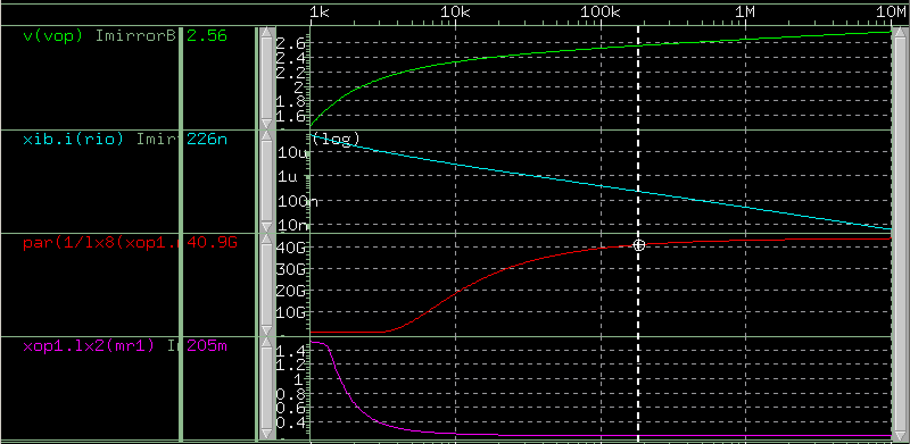
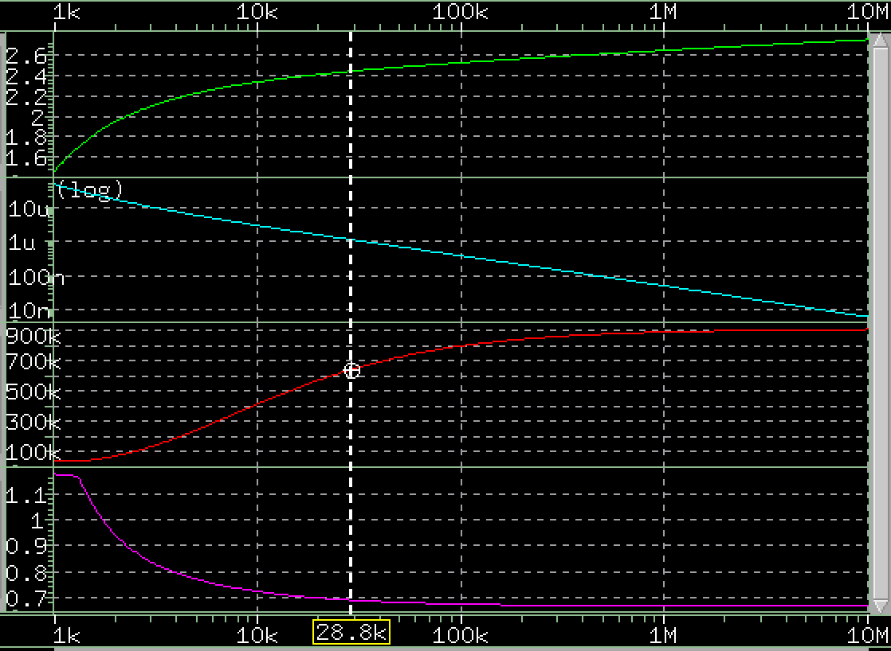
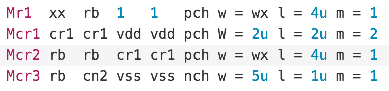
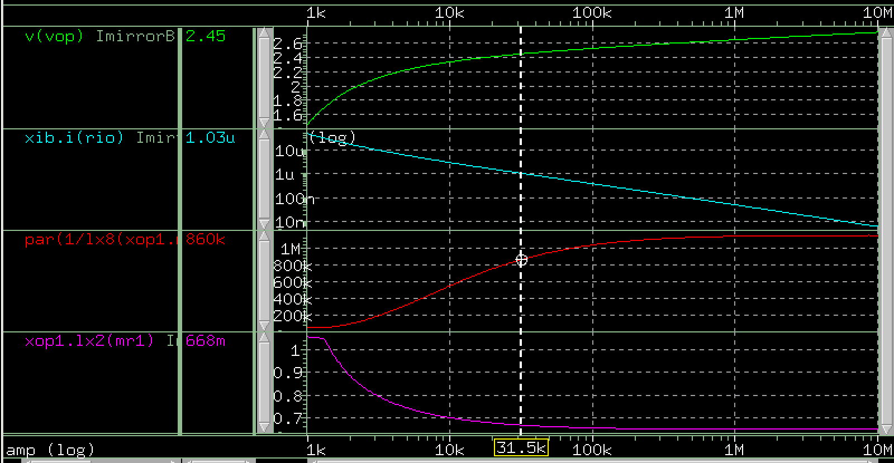
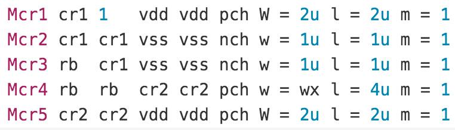
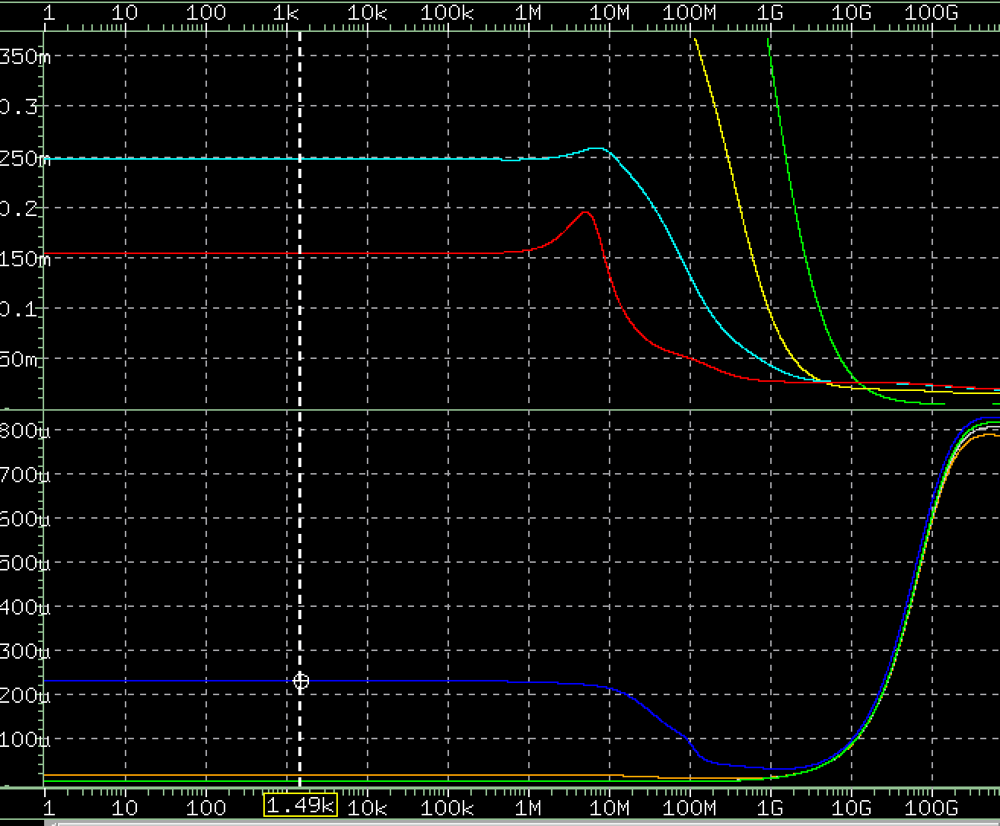
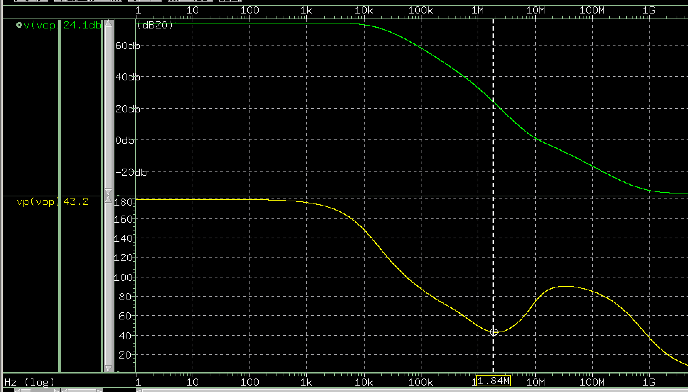

### Threshold-referenced circuit
*AnalogC 4-5*    
</img>

* This circuit remain unaffected by **VDD** *(4-5-8(b): Vgs will always be same as long as I1=I2)*
* By adjusting R(below M2), Vgs will be changed. Thus I6 can be adjusted.
* The part from the far left is a start up circuit, which is necessary

### Current Mirror
*IEEE ch20*      
</img>

* If Vdd change, M1 will help to hold Vsg of M3
* One can cal dIO/dvdd by starting from Vdd = vsg3+vgs1

### Miliier Compensation: Mos as resistance
* MyStructure is slightly smaller than structure1, which is from textbook
</img>
</img>
</img>
</img>
</img>

* **Problem encount**
</img>
</img>

### 4/10 Problem solve
the zero that cause a shallow is on the vinp to vop. Since vinp can't append more cap (this will also pull 2nd pole left and conjugate with the 1st one), we just have to **lower the "gm" of OP**. This can be achieved by lower Mb current.
